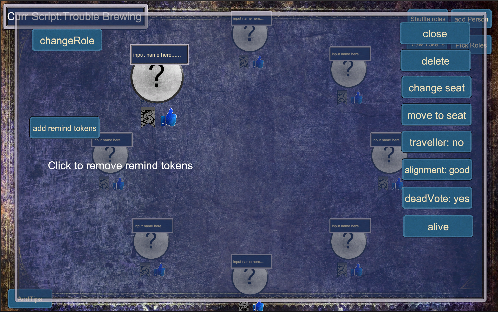

# What's this project for?
This project is for playing the game called Blood On The ClockTower. It's a social deduction game. Usually when you play it offline you need a physical copy. But this project is for replacing the copy.
# Where to run it?
Now we have a android version you can download it at release part. And also there's a online version here: [Here](https://botc-online.netlify.app/) 
# How to run it?
Before this part, make sure that you already know how to play botc(Blood On The ClockTower). Otherwise you'll feel confuse about what i'm saying.

## 1st: pick script
Click the pick script button and then you can pick a script to play.

You can also create your own script by clicking the create script button and select any characters and put the script name and click confirm.

## 2nd: add person and put name
CLick add person button to add player and use the text field to fill the name.
Click a person to change data about that person. You can change alignment, name, death or alive and so on.

## 3rd: pick roles from script
Click Pick roles button to pick roles from the script. You can add 1 random specific type character or 1 specific character.
There's a remind text to remind you how many characters there should be.

## 4th: draw tokens
Click Shuffle roles to dispatch roles, you can still change roles now if you want to homebrow some person.
When finished, Click draw tokens button and pass your device. Then everyone check their own character and pass the device until everyone know their role. Then pass the device back to storyteller and start the game.

## 5th: play games
There's so many utilities you can use. Like show something you can show text to person, you can show some roles as well.
There's also night order for reminding. You can add some empty players for remind like the demon bluffs.
If you shut off the app by accident. You can still go back to the game by clicking the button at the home page.

